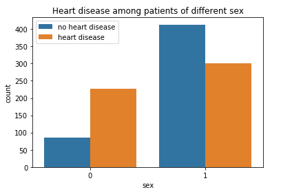

# About repo-
This is a heart disease prediction system implemented using Logistic Regression Algorithm. Logistic regression is used to predict a binary outcome based on a set of independent variables.</br>

# Data dictionary
age - age in years</br>
sex - (1 = male; 0 = female)</br>
cp - chest pain type</br>
0: Typical Angina: Chest pain related decrease blood supply to the heart </br>
1: Atypical Angeina: Chest pain not related to 
heart </br>
2: Non-anginal pain: typically esophagal spasms(non heart related) </br>
3: Asymptomatic: chest pain not showing signs of disease</br>

trestbps - resting blood pressure (in mm Hg on admission to the hospital)</br>
chol - serum cholestoral in mg/dl s erum = LDL + HDL +.2triglvcerides
above 200 is cause for concern </br>

fbs - (fasting blood sugar > 120 mg/dl) - (1 = true; 0 = false) '>126' mg/dL signals diabetes</br>

restecg - resting electrocardiographic results</br>
0: Nothing to note </br>
1: ST-T wave abnormality can range from mild symptoms to severe problems signals non-normal heart beat </br>
2: Possible or definite left ventricular hypertrophy. Enlarged heart's main pumping chamber</br>

thalach - maximum heart rate achieved</br>
exang exercise induced angina - (1 = yes; 0 = no)</br>
oldpeakST - depression induced by exercise relative to rest</br>
slope the - slope of the peak exercise ST segment</br>
ca number of major vessels - (0-3) colored by flourosopy</br>
thal 3 = normal; 6 = fixed defect; 7 = reversable defect</br>
target - 1 or 0</br>

# Plots-
* Relation between age and max heart rate achieved among all those tested positive or negative- </br>


* Heart disease found in patients of different sex- </br>


* Distribution of cholestrol among heart patients- </br>


* Relation between chest pain type and heart disease- </br>


* Who have higher cholestrol at particular ages, males or females- </br>


* Checking if max heart was achieved by people having very high fasting blood sugar- </br>


* Correlation matrix-</br>


# Technology used:
Python

# Packages used:
sklearn</br>
matplotlib </br>
seaborn </br>
pandas</br>
numpy</br>

# Environment Setup and Local Installation:
1. Drop a :star: on the Github Repository.

1.  Make sure to install python on your computer- https://www.python.org/downloads/ </br>

1. Download Python IDE or text editor for python code <br/>
*	[Install Anaconda for Windows](https://docs.anaconda.com/anaconda/install/windows/) <br/>
*	[Install Anaconda for MacOS](https://docs.anaconda.com/anaconda/install/mac-os/) <br/>
*	[Install Anaconda for Linux](https://docs.anaconda.com/anaconda/install/linux/) <br/>
*	[Install VS code for Windows/Mac/Linux](https://code.visualstudio.com/Download) </br>

1. Clone the Repo by going to your local Git Client and pushing this command: <br/>
	```git clone https://github.com/Pranav016/heart-disease-prediction-system.git```

1. Go to the AnacondaPrompt/CMD and use this command to install the packages: <br/>
	```pip install -r requirements.txt```

1. Open the project in the Jupyter Notebook/VS code to use it.
